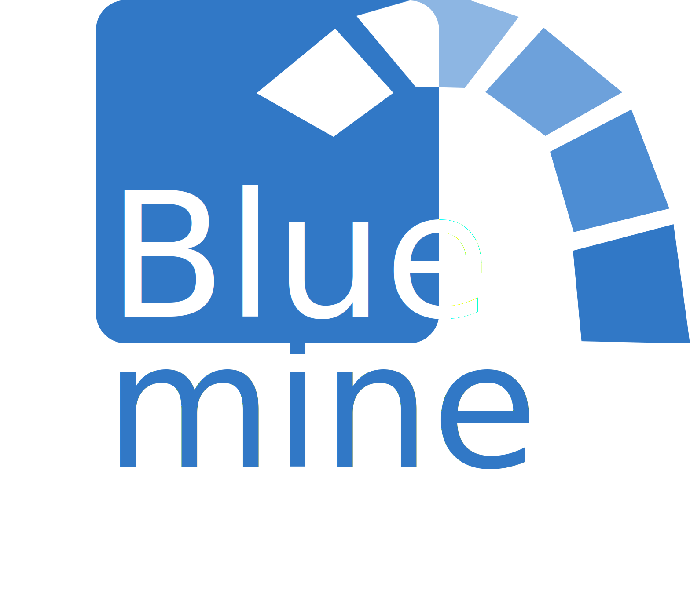

<p align="center">
	
	<br>
</p>

# Bluemine

A light zero dependencies Redmine REST API helper.

[](https://deno.land/x/bluemine)
[](https://deno.land/x/bluemine/mod.ts)

## Usage

All modules are exposed in `mod.ts`

```ts
import { Bluemine } from 'https://deno.land/x/bluemine/mod.ts'

const apiKey = Deno.env.get('REDMINE_API_KEY')
const endpoint = Deno.env.get('REDMINE_API_ENDPOINT')

const redmine = new Redmine({ apikey, endpoint })

const userList = await redmine.users.list({ limit: 20, offset: 5 })
const { id } = userList.filter(
	({ mail }) => mail === 'old.mail@example.com',
)
await redmine.users.update(id, { mail: 'new.mail@example.com' })
```

### Users

```ts
const userList = await redmine.users.list({ limit: 20, offset: 5 })
const { id } = userList.filter(
	({ mail }) => mail === 'old.mail@example.com',
)
await redmine.users.update(id, { mail: 'new.mail@example.com' })
```

### Groups

```ts
await redmine.unstableGroups.create({ name: 'my-group' })
const { groups } = await redmine.unstableGroups.list()
const [myGroup] = groups.filter(({ name }) => name === 'my-group')
await redmine.unstableGroups.addUser(myGroup.id, { id: 5 }) //add user of id 5 to 'my-group"
```

[Documentation](https://deno.land/x/bluemine/mod.ts)
